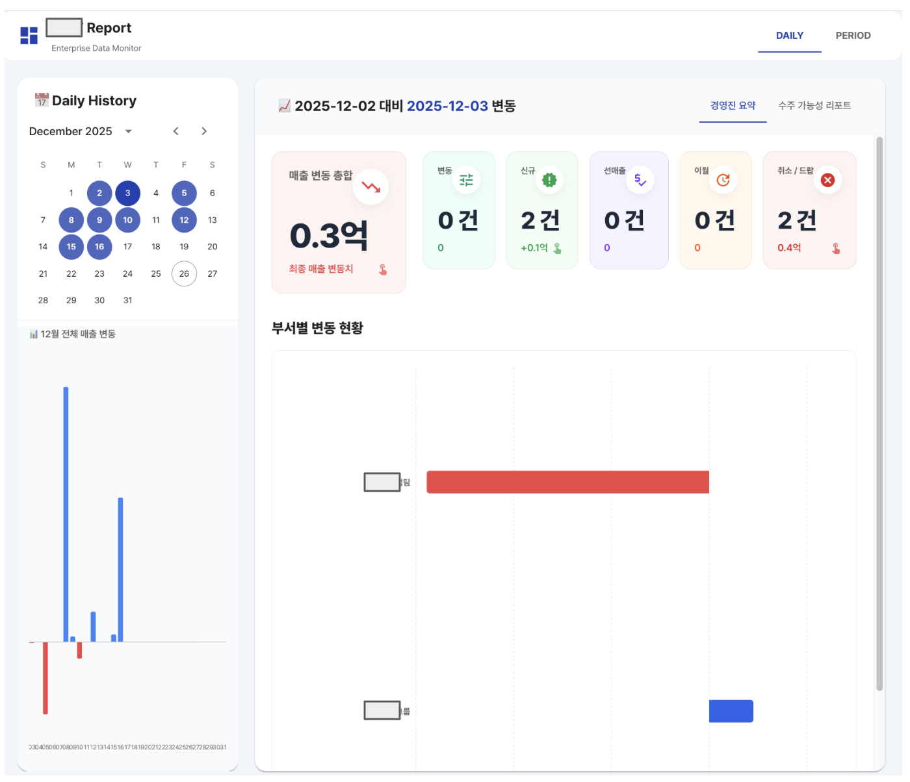

# CDC Report Dashboard

프로젝트 변동 데이터를 분석하고 시각화하는 엔터프라이즈 대시보드 시스템입니다. 일일 또는 기간별 프로젝트 데이터를 비교하여 신규 추가, 취소, 변동, 선매출, 이월 등의 변화를 자동으로 분석하고 AI 기반 인사이트를 제공합니다.

## 📸 스크린샷

### 대시보드 메인 화면


## 📋 주요 기능

- **데이터 업로드 및 관리**: 엑셀(.xlsx) 및 CSV 파일 업로드, 날짜별 데이터 관리
- **CDC 분석**: 전일 대비 또는 기간별 프로젝트 변동 자동 분석
  - 신규 추가 (New)
  - 취소/드랍 (Delete)
  - 기존 변동 (Update)
  - 선매출/증액 (Advance Sales)
  - 이월/감액 (Carry Over)
- **시각화 대시보드**
  - 경영진 요약 리포트
  - 수주 가능성 기반 필터링
  - 부문/부서별 차트
  - 일일 트렌드 차트
- **AI 인사이트**: LangChain 기반 AI 챗봇으로 데이터 분석 질의응답
- **캘린더 기반 UI**: 직관적인 날짜 선택 및 데이터 관리

## 🛠 기술 스택

### Backend
- **FastAPI** - Python 웹 프레임워크
- **SQLAlchemy** - ORM 및 데이터베이스 관리
- **SQLite** - 데이터 저장소
- **Pandas** - 데이터 처리 및 분석
- **LangChain** - AI 서비스 통합 (vLLM 지원)

### Frontend
- **React 19** - UI 프레임워크
- **Vite** - 빌드 도구
- **Material-UI (MUI)** - UI 컴포넌트 라이브러리
- **Recharts** - 데이터 시각화
- **Axios** - HTTP 클라이언트

### Infrastructure
- **Docker** & **Docker Compose** - 컨테이너화 및 배포
- **Nginx** - 프론트엔드 웹 서버 및 리버스 프록시

## 📦 설치 및 실행

### 사전 요구사항
- Docker 및 Docker Compose 설치
- (선택) Python 3.9+, Node.js 22+ (로컬 개발 시)

### Docker Compose를 사용한 실행 (권장)

1. **저장소 클론**
```bash
git clone <repository-url>
cd cdc_report
```

2. **환경 변수 설정**
`docker-compose.yml` 파일에서 AI 서비스 설정을 수정하세요:
```yaml
environment:
  - VLLM_API_BASE=http://your-vllm-server:8881/v1
  - VLLM_MODEL_NAME=llama-hist
  # 필요 시 OPENAI_API_KEY도 추가
  # - OPENAI_API_KEY=your-api-key
```

3. **컨테이너 빌드 및 실행**
```bash
docker-compose up -d --build
```

4. **접속**
- 프론트엔드: http://localhost:5173
- 백엔드 API: http://localhost:7676
- API 문서: http://localhost:7676/docs

### 로컬 개발 환경

#### Backend
```bash
cd backend
pip install -r requirements.txt
uvicorn main:app --host 0.0.0.0 --port 7676 --reload
```

#### Frontend
```bash
cd frontend
npm install
npm run dev
```

## 🚀 사용법

### 1. 데이터 업로드
1. **Daily** 탭에서 날짜를 선택
2. 해당 날짜에 엑셀 또는 CSV 파일 업로드
3. 파일은 자동으로 파싱되어 데이터베이스에 저장됩니다

### 2. 분석 실행
- **Daily 탭**: 날짜 선택 시 자동으로 전일 대비 분석 실행
- **Period 탭**: 시작일과 종료일을 선택하여 기간별 분석 실행

### 3. 리포트 확인
- **경영진 요약**: 전체 변동 통계, Top 10 프로젝트, 부문/부서별 차트
- **수주 가능성 리포트**: 확률 기반 필터링 및 상세 내역

### 4. AI 인사이트
- 분석 결과가 표시된 상태에서 우측 하단 AI 버튼 클릭
- 데이터에 대한 질문을 입력하여 AI 기반 인사이트 확인

## ⚙️ 환경 변수

### Backend 환경 변수
- `VLLM_API_BASE`: vLLM 서버 주소 (예: `http://localhost:8881/v1`)
- `VLLM_MODEL_NAME`: 사용할 모델 이름 (기본값: `llama-hist`)
- `OPENAI_API_KEY`: OpenAI API 키 (선택사항, vLLM 사용 시 불필요)

### 데이터베이스
- SQLite 데이터베이스는 `backend_data/cdc_database.db`에 저장됩니다
- Docker 볼륨 마운트를 통해 데이터가 영구 저장됩니다

## 📁 프로젝트 구조

```
cdc_report/
├── backend/
│   ├── main.py                 # FastAPI 애플리케이션 진입점
│   ├── requirements.txt        # Python 의존성
│   ├── Dockerfile              # Backend Docker 이미지
│   └── services/
│       ├── cdc_logic.py        # CDC 분석 핵심 로직
│       ├── file_handler.py     # 파일 전처리 (Excel/CSV)
│       └── ai_service.py       # AI 서비스 통합
├── frontend/
│   ├── src/
│   │   ├── App.jsx             # 메인 애플리케이션
│   │   ├── api/                # API 클라이언트
│   │   ├── components/         # React 컴포넌트
│   │   └── pages/              # 페이지 컴포넌트
│   ├── package.json            # Node.js 의존성
│   ├── Dockerfile              # Frontend Docker 이미지
│   └── nginx.conf              # Nginx 설정
├── backend_data/               # SQLite 데이터베이스 저장소
└── docker-compose.yml          # Docker Compose 설정
```

## 🔌 API 엔드포인트

### 파일 관리
- `POST /api/upload` - 파일 업로드
- `GET /api/dates` - 업로드된 날짜 목록 조회
- `DELETE /api/delete/{date}` - 날짜별 데이터 삭제

### 분석
- `POST /api/analyze` - 두 날짜 간 CDC 분석 실행
- `GET /api/stats/monthly` - 월별 통계 조회

### AI
- `POST /api/ask-report` - AI 기반 리포트 질의응답

자세한 API 문서는 `/docs` 엔드포인트에서 확인할 수 있습니다.

## 📝 데이터 형식 요구사항

업로드하는 파일은 다음 컬럼을 포함해야 합니다:
- **프로젝트 코드**: `PJT`, `PROJECT`, `코드`, `CODE` 등
- **프로젝트명**: `PJT명` 등
- **부서 정보**: `주관부서`, `부서` 등
- **부문 정보**: `부문`, `본부`, `Division`, `Sector` 등
- **월별 데이터**: `1월`, `2월`, ... `12월` 형식의 컬럼
- **수주 가능성**: `수주가능성`, `확률`, `Probability` 등 (선택사항)

## 🔒 보안 주의사항

- **환경 변수 관리**: 민감한 정보(API 키, 서버 주소 등)는 환경 변수로 관리하고 `.env` 파일을 `.gitignore`에 추가하세요
- **프로덕션 배포**: 프로덕션 환경에서는 `docker-compose.yml`의 하드코딩된 IP 주소를 환경 변수로 변경하세요
- **CORS 설정**: 프로덕션에서는 `main.py`의 CORS 설정을 적절히 제한하세요

## 👥 작성자

- **이강희**

